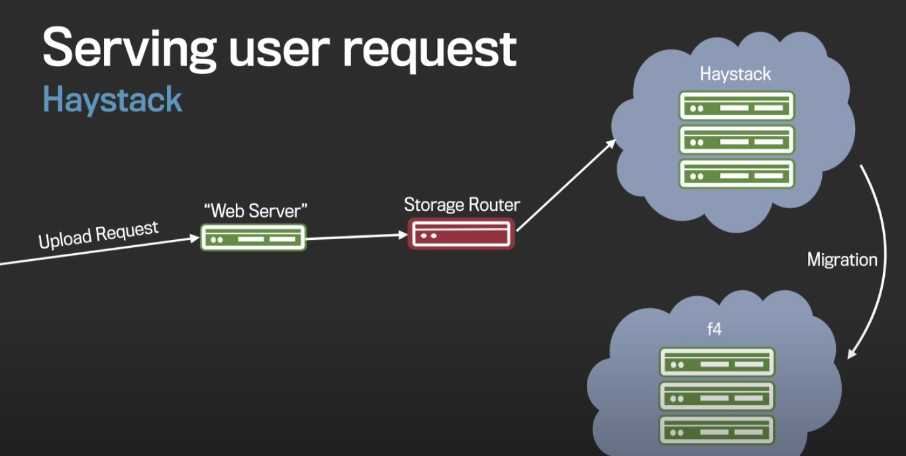

# Facebook photo growth

# Blob hotness and age

# Haystack: 2008

- High throughput 
    - in memory index
    - single i/o per request
    - multiple copies
    
- Fault tolerance 
    - RAID6
    - Multiple copies
- Central Storage size (RAID6)
    - 2 redundant drivers
    - 2 of 12 = 1.2x replication
# Motivation for warm storage
# F4

# Serving user request
- New content written to haystack
- Warm content move to f4
- Read for new content goes to haystack
- Read for warm content goes to f4

# F4: What it is solving?

# F4: Data splitting

# F4: Rebuild

# F4: Block Placement Policy

# F4: Cell anatomy

# F4: Reads

# F4: Reads on failure

# Haystack vs F4

